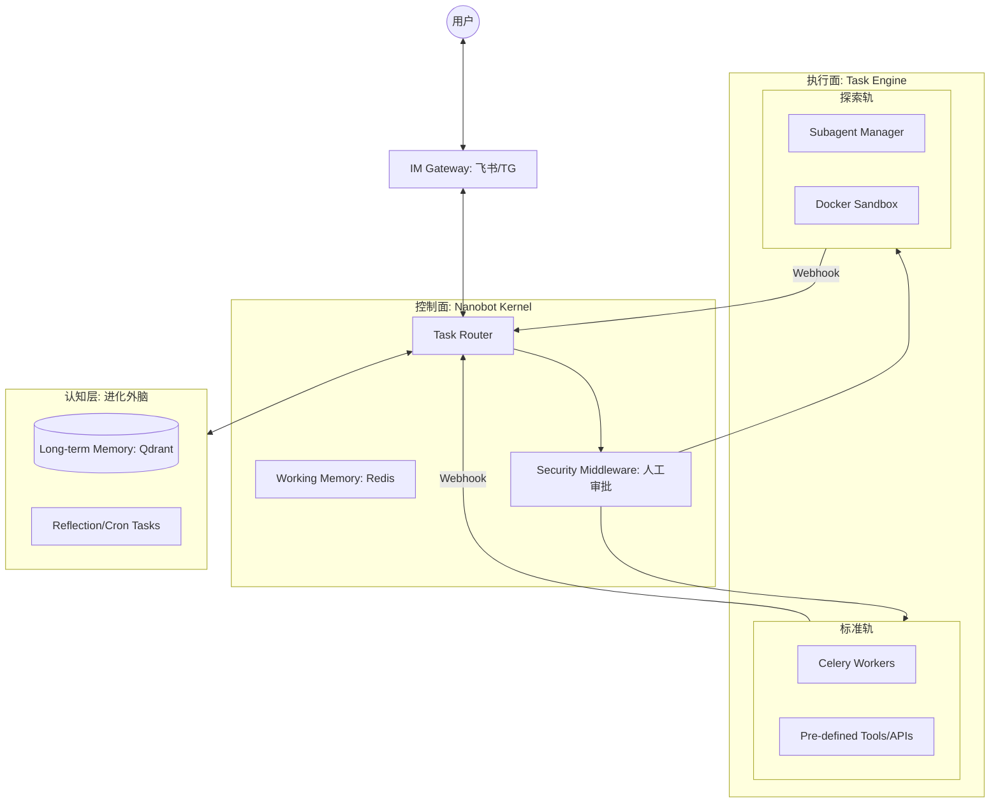

第一阶段：核心引擎与 Main Loop (1-2 周)
任务 01: 实现 Main Loop，显式分离 Thinking 与 Action 状态。

任务 02: 抽象 Provider 接口，适配 DeepSeek 与 Claude。

任务 03: 实现基于 AGENTS.md 的提示词动态组装与热加载。

任务 04: 接入飞书/IM 网关，打通事件流。

第二阶段：工具链与异步交互 (2-3 周)
任务 05: 构建 Tool Registry，支持并行工具调用分发。

任务 06: 搭建 Celery + Redis 异步任务队列。

任务 07: 实现 Webhook 回调机制，确保后台结果能主动唤醒 IM 会话。

任务 08: 开发模糊匹配的 Edit 工具（用于修改策略参数）。

第三阶段：稳定控制与中间件 (3-4 周)
任务 09: 开发中间件拦截器，实现实盘交易指令的人工审批流。

任务 10: 引入 System Reminders 机制，监控 Agent 的死循环倾向。

任务 11: 实现基于 Session 的物理内存管理与层级化 Context 压缩。

第四阶段：子智能体与沙盒 (4-6 周)
任务 12: 开发 Subagent Manager，支持动态派生子智能体处理复杂任务。

任务 13: 集成 Docker SDK，构建受限的执行沙盒。

任务 14: 植入错误恢复模板（Error Recovery），增强 Subagent 的自愈能力。

第五阶段：可观测性与进化 (6-8 周)
任务 15: 引入 Tracing 机制，在底座层拦截并记录 Token 消耗与执行耗时。

任务 16: 构建基准测试（Benchmark）脚本，科学评估脚手架性能。

任务 17: 实现基于向量库的“认知沉淀”，让 Agent 学习用户的量化习惯。

这份 `ARCHITECTURE.md` 是专为 **Vibe Coding**（AI 辅助编程）设计的。它不仅定义了系统的静态结构，还详细描述了动态的任务流转逻辑。你可以直接将这个文档喂给 Cursor 或 Windsurf，作为项目的“宪法”。

---

# Architecture & Development Plan: Universal Agent Harness (UAH)

## 1. 系统愿景 (Vision)

构建一个“控制与执行分离”的通用智能体操作系统底座。

* **控制面 (Nanobot Kernel):** 轻量级、非阻塞、负责 IM 交互与任务分发。
* **执行面 (Dual-Track Engine):** * **标准轨:** 高性能 API + Celery 异步任务。
* **探索轨:** 动态生成的 Subagent + Docker 沙盒环境。


## 2. 核心架构图 (System Layers)



## 3. 详细组件设计 (Component Design)

### A. 控制面 (Nanobot Kernel)

* **Session Isolation:** 每个用户/群组拥有独立的 UUID 和 Redis 存储的对话状态。
* **Async Interface:** 采用 FastAPI 驱动，所有对外调用（IM 发送、Webhook 接收）必须是 `async`。
* **Task Suspend/Resume:** 中间件在拦截指令后，将任务上下文持久化，待用户点击回调后再恢复。

### B. 标准执行轨 (Celery Track)

* **Communication:** Agent 调用工具 -> 返回 TaskID -> 用户端显示进度 -> Celery 完工 -> Webhook 触发。
* **Persistence:** 回测生成的图表、CSV 文件统一存入对象存储，仅通过 Webhook 传递 URL。

### C. 探索执行轨 (Subagent Sandbox)

* **Spawner:** 主 Agent 确定任务不可通过预设 API 完成时，触发 Subagent 实例。
* **Self-Healing:** Subagent 内部包含 `while retry < N` 逻辑：执行代码 -> 捕获错误 -> 修正代码 -> 重试。
* **Docker Security:** 强制限制 `Network=none` (除非需要爬虫) 且限制内存 CPU。

### D. 进化记忆 (Hermes Logic)

* **Context Compaction:** 当 Context 接近 80% 阈值，调用 LLM 进行摘要提取，清空历史，注入摘要。
* **Daily Reflection:** 每日收盘后，异步扫描日志，提取用户习惯（参数偏好、避坑经验）存入 VectorDB。

## 4. 异步 Webhook 通信协议 (Callback Protocol)

所有异步任务完工后，必须向控制面发送如下标准的 JSON：

```json
{
  "task_id": "uuid-v4",
  "source": "celery | subagent",
  "status": "success | error | approval_required",
  "payload": {
    "text": "人类可读的结果摘要",
    "data": {},
    "files": ["url1", "url2"]
  },
  "error_msg": "只有 status 为 error 时存在"
}

```

---

## 5. 开发计划 (Development Plan / Milestones)

### 第一阶段：连接与闭环 (Week 1)

* [ ] 初始化 Nanobot 项目，接入飞书/TG Webhook。
* [ ] 实现核心 Main Loop，接入 DeepSeek/OpenAI。
* [ ] 完成 `/api/callback` Webhook 基础接收端。

### 第二阶段：异步能力建设 (Week 2-3)

* [ ] 配置 Redis + Celery 基础环境。
* [ ] 开发第一个标准量化 Tool：获取实时行情（同步）+ 获取历史回测（异步 Celery）。
* [ ] 实现 Webhook 结果反向推送到 IM。

### 第三阶段：安全与拦截逻辑 (Week 4)

* [ ] 实现中间件拦截逻辑，能区分“高危”工具。
* [ ] 开发飞书卡片消息，实现“点击按钮 -> 触发 API -> 恢复任务执行”的全流程。

### 第四阶段：Subagent 沙盒系统 (Week 5-6)

* [ ] 集成 Docker SDK。
* [ ] 开发 Subagent 专用的 Prompt 模板（Focus on Python coding & Self-healing）。
* [ ] 实现文件交换机制（沙盒内生成图片，宿主机提取）。

### 第五阶段：长期记忆与进化 (Week 7-8)

* [ ] 集成 Qdrant 向量库。
* [ ] 开发对话摘要压缩逻辑。
* [ ] 实现定时任务（Reflection），提取用户偏好。

---

## 6. Vibe Coding 准则 (AI Collaboration Rules)

1. **接口契约:** 在要求 AI 写任何功能前，先定义好输入输出的 JSON 结构。
2. **原子化开发:** 每次只在一个文件内进行 Vibe Coding，不要跨文件重构，除非你手动确认了引用关系。
3. **日志为王:** 所有异步操作必须有详细的 `logging.info`，方便 AI 读日志排查 Webhook 丢失问题。

---


